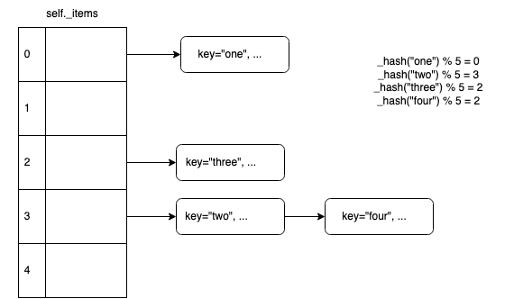
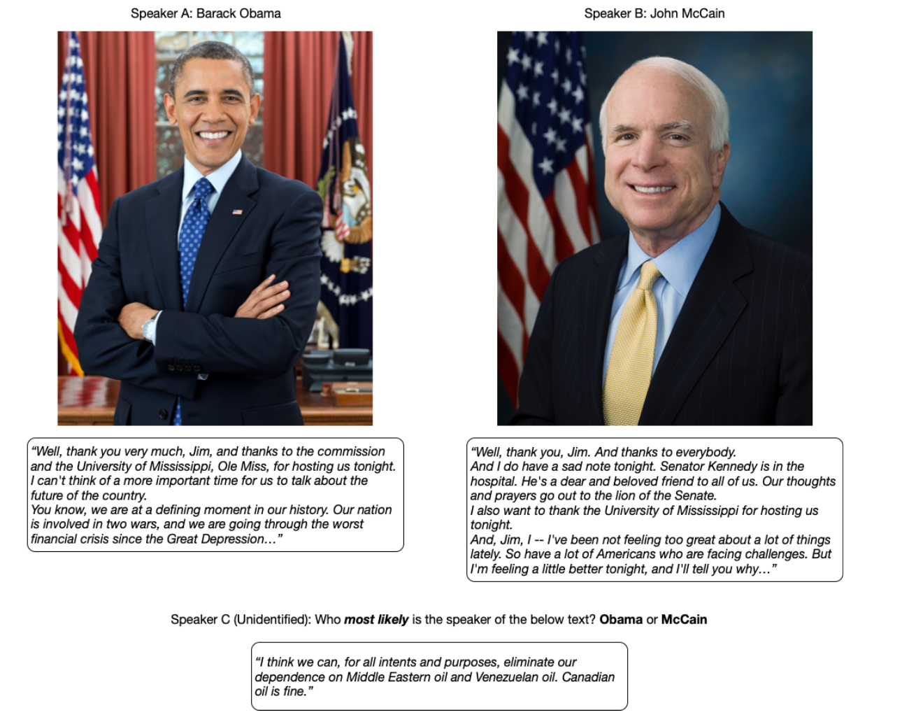
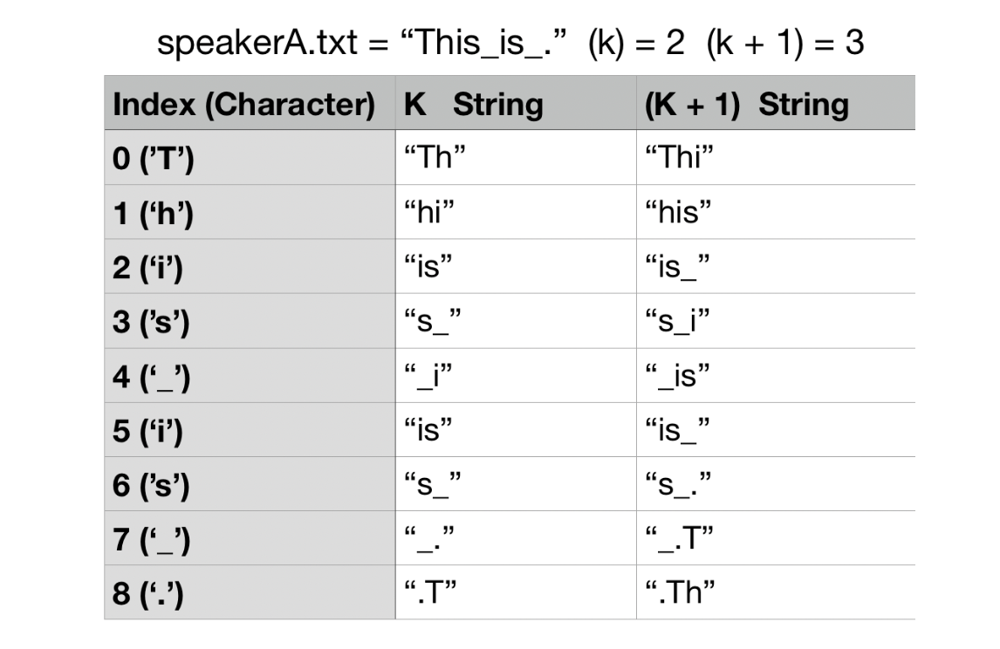
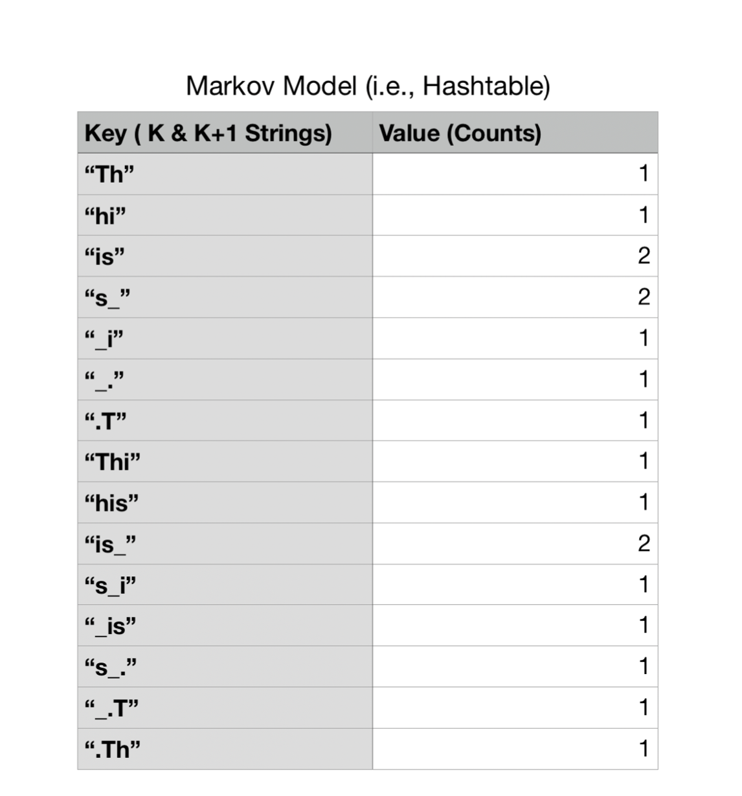
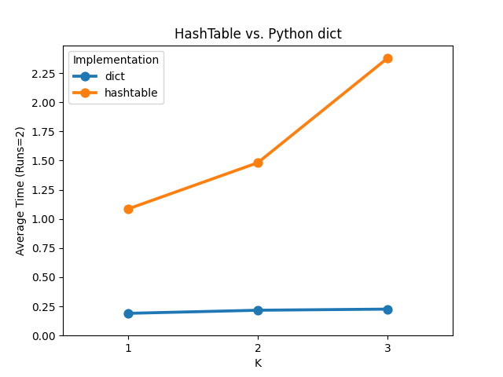

# Markov Models Speaker Recognition

## Introduction

Markov models can be used to capture the statistical relationships present in a language like English. These models allow us to go beyond simplistic observations, like the frequency with which specific letters or words appear in a language, and instead to capture the relationships between words or letters in sequences. As a result, we can not only appreciate that the letter “q” appears in text at a certain rate, but also that it is virtually always followed by a “u.” Similarly, “to be” is a much more likely word sequence than “to is.”

One application of Markov models is in analyzing actual text and assessing the likelihood that a particular person uttered it. This is what the project is about. 

Additionally, as Markov models rely heavily on hash table look-ups, we will try to develop a hash table from scratch and compare performance. The hash table can be tweaked after as needed to optimize performance. 

## Custom Hash Table: hashtable.py

A custom hash table has been built using a doubly linked list. Separate chaining is used to handle collision. As the number of items grow in the hash table, the hash table will be resized and items will be rehashed. 

A diagram of a hash table with separate chaining is shown below:



## Speaker Recognition System: markov.py



Markov models are used significantly in speech recognition systems, and used heavily in the domains of natural language processing, machine learning, and AI.

A Markov model defines a probabilistic mechanism for randomly generating sequences over some alphabet of symbols. A `k`-th order Markov model tracks the last `k` letters as the context for the present letter. We will build a module called `markov` that will work for any positive value of `k` provided.  This module will reside in `proj/markov.py`

Given a string of text from an unidentified speaker, we will use a Markov model for a known speaker to assess the likelihood that the text was uttered by that speaker. Thus, the first step is building a Markov Model on known text from a speaker. For this assignment, the Markov Model will be represented as a `Hashtable`.

Given an integer value of `k` at the start of the program, each key-value pairing inside the table contains string keys with length `k` and `k + 1` and values set to the number of times those keys appeared in the text as substrings.

For example, let’s say we have a file called speakerA.txt that contains the following text:

```
This_is_.
```

Punctuation, special characters, whitespace characters, etc., are all considered valid. 

We will use this text `"This_is_."` to create a Markov model for Speaker A.  The algorithm is as follows:

Starting from the beginning of text from some known speaker:

1. For each character in the known text, we generate a string of length `k` that includes the current character plus k−1 succeeding characters (*Note:* The model actually works by finding the k preceding letters but our way works too because we are using a wrap-around effect.).
2. For each character in the known text, we generate a string of length `k+1` that includes the current character plus `k` succeeding characters.  (e.g. for the first character 'T', we'd generate 'Th' and 'Thi' if k=2)
3. For certain characters, they will not have `k` or `k+1` succeeding characters. We will **wrap around**: we will think of the string circularly, and glue the beginning of the string on to the end to provide a source of the needed context.  (e.g. for the example string the strings generated for the last character '.' would be '.T' and '.Th'.)

Below is a diagram of all the k and k+1 length strings that are generated from the speakerA.txt file given k=2:



The Markov Model (i.e., `Hashtable`) will contain the number of times those `k` and `k + 1` were generated via the known text. Thus, for the speakerA.txt file, the Markov Model generated will be the following:



Most of the `k` and `k+1` strings were only generated once, but some such as `"is"` occur more than once.

As we stated earlier, given a string of text from an unidentified speaker, we will use the Markov model for a known speaker to assess the likelihood that the text was uttered by that speaker. Likelihood, in this context, is the probability of the model generating the unknown sequence.

We will make the models learn for `speech1` and `speech2`, calculate the **normalized log probabilities** that those two speakers uttered `speech3` and determine which speaker is more likely.

## Driver Files: driver.py

We have implemented a driver for the speaker recognition system inside `proj/driver.py`.
There are a set of files containing text from United States presidential debates from the 2004 and
2008 general elections. In the 2004 election, George W. Bush debated John Kerry; in the 2008 debates,
Barack Obama went up against John McCain. We have provided single files for Bush, Kerry, Obama, and
McCain to use to build models. These files contain all the text uttered by the corresponding candidates from two debates. We have also provided directories from the third debates of each election year, containing many files, appropriately labeled, that have remarks made by one of the candidates.

The application will read in text from the text files and call the `identify_speaker` function to retrieve log probabilities and the most likely speaker. It should then print output like the following:

```
$ python proj/driver.py speeches/bush1+2.txt speeches/kerry1+2.txt speeches/bush-kerry3/BUSH-0.txt 2 hashtable
Speaker A: -2.1670591295191572
Speaker B: -2.2363636778055525

Conclusion: Speaker A is most likely
```

## Performance Testing: performance.py

Finally, another driver file `proj/performance.py` can be used to run performance tests on the `Markov` class with the `Hashtable` and `dict` modes. The performance will be graphed like the following:




## Acknowledgment
This project was originated from CAPP 30122 Team @ The University of Chicago. The original development of the assignment was done by Rob Schapire with contributions from Kevin Wayne. 
